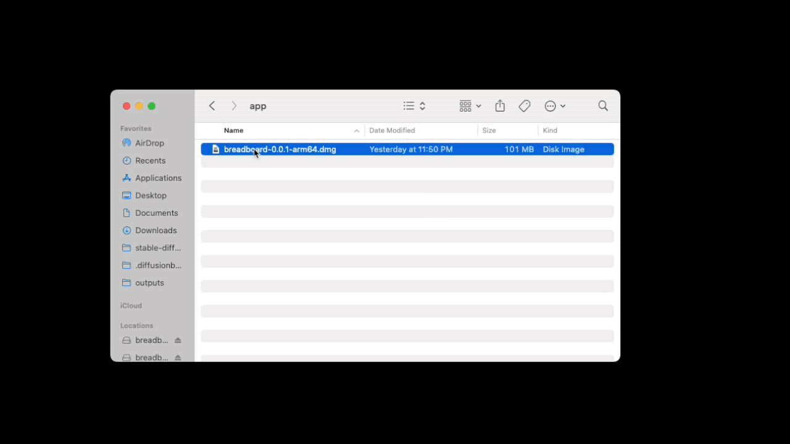
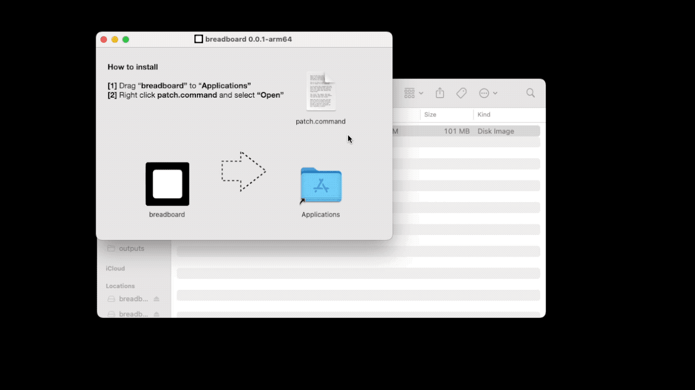

# Intro

> Browse, search, and manage all AI generated images on your machine, in one place.

1. **Browse:** Browse images and their extracted metadata in one place
2. **Search:** Quickly search images by prompt
3. **Manage:** select and bulk delete files, drag and drop to any other app for seamless integrated workflows.

---

# Download

Breadboard works on all platforms (Mac, Windows, Linux)

---

## 1. Mac

### 1.1. Download

Download and run the DMG file here: 

<a href="https://github.com/cocktailpeanut/breadboard/releases/download/genesis/breadboard-0.0.1-arm64.dmg" class='large btn'><i class="fa-brands fa-apple"></i> Download for Mac</a>

### 1.2. Move to Applications

From the DMG installer, drag the "breadboard" app to the "Applications" folder

### 1.3. Run patch

Now, run the "patch.command" program by **right clicking** and then selecting "open".

It will ask you to enter your system password, in order to

The patch script is ncessary in order to avoid Apple's "Gatekeeper" feature that disallows opening apps that were not published through Apple's own App Store. It is completely secure, and you can check the script code yourself (it's just one line): [script/patch.command](https://github.com/cocktailpeanut/breadboard/blob/main/script/patch.command)

> Learn more here: https://apple.stackexchange.com/questions/436674/how-to-unblock-binary-from-use-because-mac-says-it-is-not-from-identified-develo

### 1.4. Open the app

Now just go to the Applications folder and find the breadboard app, and launch it. That's all!

---

## 2. Windows

On widows, you can simply download and run the setup file here:

<a href="https://github.com/cocktailpeanut/breadboard/releases/download/genesis/breadboard.Setup.0.0.1.exe" class='big btn'><i class="fa-brands fa-windows"></i> Download for Windows</a>

---

## 3. Linux

From the download links, download the file format supported by your Linux distro and run it:

<a href="https://github.com/cocktailpeanut/breadboard/releases/tag/genesis" class='big btn'><i class="fa-brands fa-linux"></i> Download for Linux</a>

---

# Supported file formats

Currently supports files generated by the following apps, out of the box:

- Diffusionbee: https://diffusionbee.com
- Automatic111: https://github.com/AUTOMATIC1111/stable-diffusion-webui
- InvokeAI: https://invoke-ai.github.io/InvokeAI/

Designed with extensibility in mind, and can support other formats in the future (Feel free to open an issue to request)

---

# Questions and Feedback

- **Questions:** Join the Discord channel to ask questions https://discord.gg/dZywHttS
- **News and updates:** Follow the creator on Twitter to stay updated https://twitter.com/cocktailpeanut
- **Requests reports:** Open an issue on Github to share feature requests and bug reports https://github.com/cocktailpeanut/breadboard/issues

---

